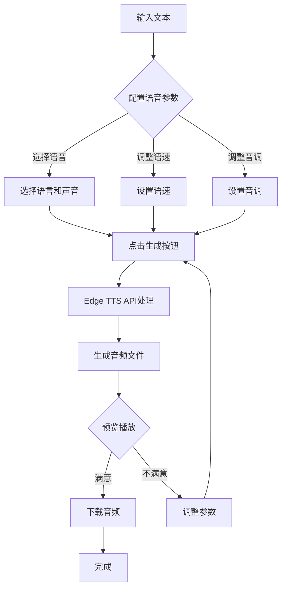

# Edge TTS 在线音频制作工具 - 产品需求文档

## 1. 产品概述

一款基于微软Edge浏览器TTS引擎的在线文本转语音工具，帮助用户快速将文本转换为自然语音音频。

**主要目标用户：**
- 内容创作者
- 有声书制作者
- 教育工作者
- 需要语音合成的个人和小型团队

**核心价值：**
- 免费使用Edge高质量TTS语音
- 支持多种语言和声音选择
- 实时预览和下载
- 轻量级，支持本地部署
- 完美支持移动端Termux环境

## 2. 核心功能

### 2.1 功能模块

1. **首页/主界面**
   - 文本输入区域（支持多行）
   - 语音参数配置面板
   - 音频播放控制
   - 下载功能区

2. **语音配置模块**
   - 语音选择（多语言、多声音）
   - 语速调节（0.5x - 2.0x）
   - 音调调节（0.5x - 2.0x）
   - 音量调节

3. **音频处理模块**
   - 实时语音合成
   - 音频预览播放
   - WAV/MP3格式输出
   - 音频文件下载

4. **项目历史模块**
   - 最近转换记录
   - 本地存储
   - Git集成（可选）

### 2.2 页面详情

| 页面名称 | 模块名称 | 功能描述 |
|---------|---------|---------|
| 主界面 | 文本输入区 | 多行文本输入，支持粘贴 |
| 主界面 | 语音配置面板 | 选择语音、调整参数 |
| 主界面 | 音频播放器 | 播放/暂停、进度条、音量控制 |
| 主界面 | 下载控制区 | 下载为WAV/MP3格式 |

## 3. 核心流程

### 3.1 主要用户流程

```
用户输入文本 → 配置语音参数 → 点击生成 → 预览播放 → 下载音频
```

### 3.2 流程图



## 4. 用户界面设计

### 4.1 设计风格

**设计理念：**
- 现代简洁、专注内容
- 深色主题为主，减少视觉疲劳
- 渐变色背景增加层次感
- 圆角卡片设计

**配色方案：**
- 主色调：#6366F1（靛蓝色）
- 辅助色：#8B5CF6（紫色）
- 背景色：#0F172A（深夜蓝）
- 卡片背景：#1E293B（深灰蓝）
- 文字色：#F1F5F9（浅灰白）
- 强调色：#22D3EE（青色）

**字体选择：**
- 标题：Noto Sans SC（思源黑体）
- 正文：Inter（英文）/ Noto Sans SC（中文）
- 代码/参数：JetBrains Mono

**布局风格：**
- 单页应用（React SPA）
- 左右分栏：左侧输入区，右侧预览区
- 响应式：移动端堆叠布局
- 卡片式组件设计

### 4.2 移动端适配

**Termux环境优化：**
- 全屏布局利用屏幕空间
- 触摸友好的大按钮
- 清晰的视觉反馈
- 适配小屏幕的紧凑布局

**响应式断点：**
- 桌面端：> 1024px（左右分栏）
- 平板端：768px - 1024px（紧凑分栏）
- 移动端：< 768px（垂直堆叠）

## 5. 技术架构

### 5.1 技术选型

**前端框架：**
- React 18 + Vite
- TailwindCSS 3（样式框架）
- 波纹动画和过渡效果

**后端服务：**
- Node.js + Express
- edge-tts npm包处理TTS
- CORS跨域支持

**构建和部署：**
- 支持Docker部署
- 支持传统Node.js部署
- Termux原生支持

### 5.2 移动端Termux部署方案

**环境要求：**
- Termux (Android)
- Node.js 18+
- npm或yarn

**部署步骤：**
1. 安装Termux
2. 安装Node.js：`pkg install nodejs`
3. 克隆项目代码
4. 安装依赖：`npm install`
5. 启动服务：`npm run dev` 或 `node server/index.js`

### 5.3 Git集成

项目提供：
- Git初始化脚本
- 提交日志规范
- 基本的.gitignore配置
- 支持自定义项目仓库

## 6. 非功能性需求

### 6.1 性能要求
- 首次加载 < 3秒
- 语音生成延迟 < 2秒（取决于文本长度）
- 移动端流畅运行

### 6.2 兼容性
- 现代浏览器（Chrome、Firefox、Safari、Edge）
- 移动端浏览器
- Termux内嵌浏览器/WebView

### 6.3 用户体验
- 实时参数预览
- 加载状态指示
- 错误提示友好
- 键盘快捷键支持

## 7. 未来扩展

- 多音轨合成
- 音频格式转换
- 云端存储
- 团队协作功能
- 更多语音库支持
