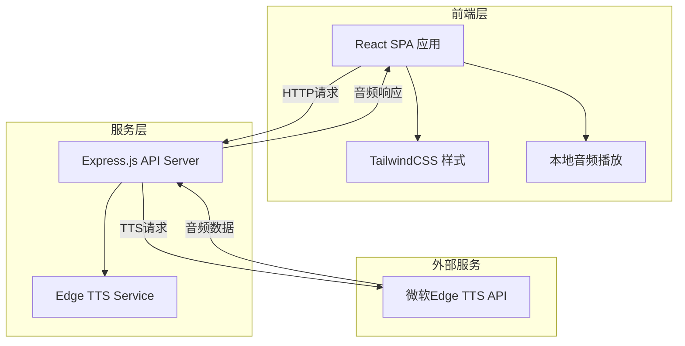
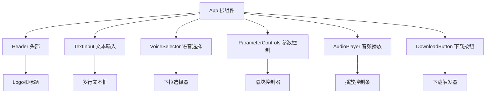

# Edge TTS 在线音频制作工具 - 技术架构文档

## 1. 架构设计

### 1.1 整体架构



### 1.2 技术栈

| 层级 | 技术 | 版本 | 说明 |
|------|------|------|------|
| 前端框架 | React | 18.x | UI框架 |
| 构建工具 | Vite | 5.x | 快速构建 |
| 样式框架 | TailwindCSS | 3.x | 原子化CSS |
| 后端框架 | Express | 4.x | API服务 |
| TTS引擎 | edge-tts | 6.x | 微软Edge TTS |
| 包管理 | npm | 10.x | 依赖管理 |

## 2. 目录结构

```
/workspace
├── server/                 # 后端服务
│   ├── index.js           # Express服务器入口
│   ├── tts-service.js     # TTS处理服务
│   └── package.json       # 后端依赖
├── src/                    # 前端源码
│   ├── components/        # React组件
│   │   ├── TextInput.jsx         # 文本输入组件
│   │   ├── VoiceSelector.jsx     # 语音选择器
│   │   ├── AudioPlayer.jsx       # 音频播放器
│   │   └── Controls.jsx          # 控制面板
│   ├── App.jsx            # 主应用组件
│   ├── main.jsx           # 入口文件
│   └── index.css          # 全局样式
├── public/                 # 静态资源
├── index.html             # HTML模板
├── package.json           # 前端依赖
├── vite.config.js         # Vite配置
├── tailwind.config.js     # Tailwind配置
├── postcss.config.js      # PostCSS配置
├── .gitignore            # Git忽略配置
├── README.md             # 项目说明
└── deploy-termux.sh      # Termux部署脚本
```

## 3. API定义

### 3.1 TTS语音合成接口

**请求**
```
POST /api/tts
Content-Type: application/json
```

**请求体**
```json
{
  "text": "要转换的文本内容",
  "voice": "zh-CN-XiaoxiaoNeural",
  "rate": "+0%",
  "pitch": "+0Hz",
  "volume": "+0%"
}
```

**响应**
```
Content-Type: audio/mpeg
Content-Disposition: attachment; filename="output.mp3"

<二进制音频数据>
```

**错误响应**
```json
{
  "error": "错误信息描述",
  "code": "ERROR_CODE"
}
```

### 3.2 可用语音列表

**请求**
```
GET /api/voices
```

**响应**
```json
{
  "voices": [
    {
      "name": "zh-CN-XiaoxiaoNeural",
      "shortName": "Xiaoxiao",
      "gender": "Female",
      "locale": "zh-CN",
      "friendlyName": "晓晓（女声）"
    }
  ]
}
```

### 3.3 健康检查

**请求**
```
GET /api/health
```

**响应**
```json
{
  "status": "ok",
  "timestamp": "2024-01-01T00:00:00.000Z"
}
```

## 4. 数据模型

### 4.1 语音配置模型

```typescript
interface VoiceConfig {
  voice: string;      // 语音标识符
  rate: string;       // 语速 (+/-百分比)
  pitch: string;      // 音调 (+/-Hz)
  volume: string;     // 音量 (+/-百分比)
}

interface TTSRequest {
  text: string;       // 输入文本
  config: VoiceConfig;
}
```

### 4.2 语音元数据

```typescript
interface VoiceMetadata {
  name: string;           // 完整标识符
  shortName: string;       // 简短名称
  gender: 'Male' | 'Female';
  locale: string;          // 语言区域
  friendlyName: string;    // 友好显示名称
}
```

## 5. 核心模块设计

### 5.1 TTS服务模块 (tts-service.js)

**职责：**
- 与Edge TTS API通信
- 音频格式转换
- 错误处理和重试

**关键方法：**
```javascript
class TTSService {
  async synthesize(text, config)  // 合成语音
  async getAvailableVoices()      // 获取语音列表
  validateText(text)              // 文本验证
}
```

### 5.2 前端组件架构



## 6. 部署方案

### 6.1 Termux部署（移动端）

**部署脚本：deploy-termux.sh**

```bash
#!/bin/bash
# Termux部署脚本

# 1. 更新包
pkg update && pkg upgrade -y

# 2. 安装Node.js
pkg install nodejs -y

# 3. 安装git
pkg install git -y

# 4. 克隆项目（如果需要）
# git clone <repository-url>

# 5. 安装后端依赖
cd server && npm install

# 6. 安装前端依赖
cd .. && npm install

# 7. 启动服务
echo "启动Edge TTS服务..."
node server/index.js
```

### 6.2 开发环境

```bash
# 安装依赖
npm install

# 启动开发服务器（前端+后端）
npm run dev

# 或分别启动
npm run server  # 仅后端
npm run client  # 仅前端
```

### 6.3 生产环境

```bash
# 构建前端
npm run build

# 启动生产服务器
npm start
```

## 7. Git配置

### 7.1 .gitignore内容

```
node_modules/
dist/
.env
*.log
.DS_Store
.idea/
.vscode/
```

### 7.2 提交规范

```
feat: 新功能
fix: 修复bug
docs: 文档更新
style: 代码格式调整
refactor: 重构
test: 测试相关
chore: 构建或辅助工具更新
```

## 8. 环境变量

### 8.1 配置项

| 变量名 | 默认值 | 说明 |
|--------|--------|------|
| PORT | 3001 | API服务端口 |
| HOST | localhost | 服务地址 |
| CORS_ORIGIN | * | 跨域配置 |

## 9. 错误处理

### 9.1 错误代码

| 代码 | 描述 | 处理建议 |
|------|------|----------|
| TEXT_EMPTY | 文本为空 | 提示用户输入文本 |
| TEXT_TOO_LONG | 文本过长 | 分段处理 |
| VOICE_NOT_FOUND | 语音不存在 | 选择有效语音 |
| NETWORK_ERROR | 网络错误 | 检查连接，重试 |
| API_ERROR | API错误 | 查看详细错误信息 |

## 10. 性能优化

### 10.1 前端优化
- 组件懒加载
- 音频文件压缩
- 本地缓存

### 10.2 后端优化
- 请求去重
- 响应压缩
- 超时控制

## 11. 安全性

### 11.1 输入验证
- 文本长度限制（单次10000字符）
- 特殊字符过滤
- SQL注入防护

### 11.2 CORS配置
- 开发环境：允许所有源
- 生产环境：限制特定域名
