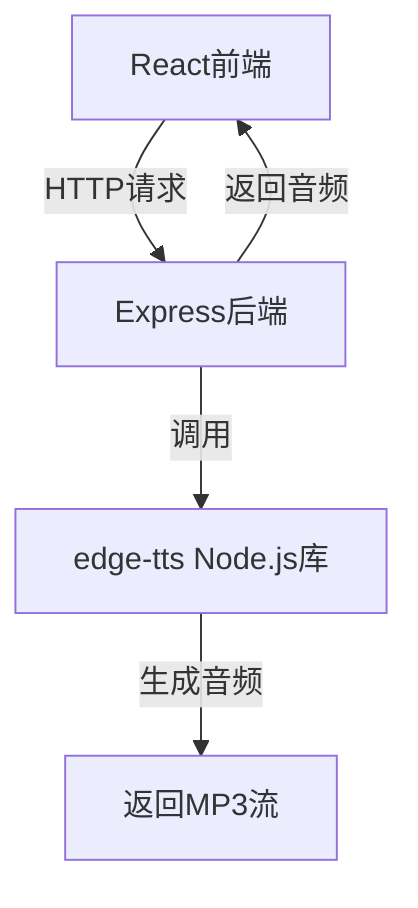
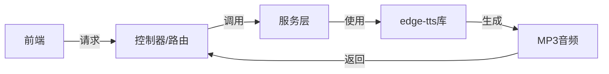

## 1. Architecture Design


## 2. Technology Description
- Frontend: React@18 + TypeScript + tailwindcss@3 + vite
- Initialization Tool: vite-init
- Backend: Express@4 + TypeScript
- External Services: edge-tts库

## 3. Route Definitions
| Route | Purpose |
|-------|---------|
| / | 主页 |
| /api/voices | 获取可用发音人列表 |
| /api/generate | 生成音频 |

## 4. API Definitions

### 4.1 获取发音人列表
```typescript
interface Voice {
  Name: string;
  ShortName: string;
  Gender: string;
  Locale: string;
}

// GET /api/voices
type GetVoicesResponse = Voice[];
```

### 4.2 生成音频
```typescript
// POST /api/generate
interface GenerateAudioRequest {
  text: string;
  voice: string;
  rate?: string; // e.g., "+0%", "-10%"
  volume?: string; // e.g., "+0%", "-10%"
  pitch?: string; // e.g., "+0Hz", "-10Hz"
}

// 响应：audio/mpeg 流
```

## 5. Server Architecture Diagram


## 6. Data Model
不需要数据库，使用内存存储临时音频文件或直接流式返回。

