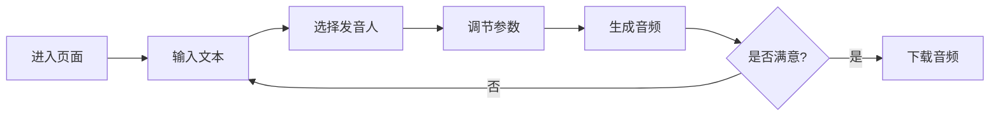

## 1. Product Overview
EdgeTTS在线音频制作工具是一款面向普通用户的语音合成应用，用户可以输入文本、选择发音人和语速，生成音频并下载。
- 解决了用户快速获取高质量音频内容的需求，无需安装复杂软件
- 目标用户为需要语音合成内容的创作者、学习者、有声书制作等人群

## 2. Core Features

### 2.1 User Roles (if applicable)
无需用户登录，所有访客均可直接使用全部功能。

### 2.2 Feature Module
1. **主页面**：文本输入区域、发音人选择、语速调节、音频生成按钮、播放和下载功能
2. **历史记录**：保存最近生成的音频记录（可选功能）

### 2.3 Page Details
| Page Name | Module Name | Feature description |
|-----------|-------------|---------------------|
| 主页面 | 文本输入 | 支持多行文本输入，显示字数统计 |
| 主页面 | 发音人选择 | 提供多种EdgeTTS支持的发音人，按语言分组 |
| 主页面 | 参数调节 | 语速、音量、音调调节 |
| 主页面 | 音频生成 | 点击生成按钮，调用后端API生成音频 |
| 主页面 | 音频播放 | 内置音频播放器，支持播放、暂停、进度控制 |
| 主页面 | 下载功能 | 将生成的音频下载为MP3文件 |

## 3. Core Process
用户进入页面 → 输入文本 → 选择发音人 → 调节参数 → 点击生成 → 播放预览 → 满意后下载音频

## 4. User Interface Design
### 4.1 Design Style
- 主色调：深蓝色(#2563eb)搭配浅蓝(#93c5fd)
- 按钮风格：圆角矩形，带hover效果
- 字体：Inter，标题24px，正文16px
- 布局风格：卡片式布局，居中对齐
- 图标风格：简洁的线性图标

### 4.2 Page Design Overview
| Page Name | Module Name | UI Elements |
|-----------|-------------|-------------|
| 主页面 | 输入区 | 大文本框，带占位符提示，右下角字数统计 |
| 主页面 | 控制面板 | 下拉选择器、滑块控件，整齐排列 |
| 主页面 | 操作按钮 | 主生成按钮大而醒目，下载按钮在播放器旁 |
| 主页面 | 播放器 | 进度条、播放/暂停、音量控制 |

### 4.3 Responsiveness
移动优先设计，适配手机端（Termux部署），触摸友好，控件大小适中。

